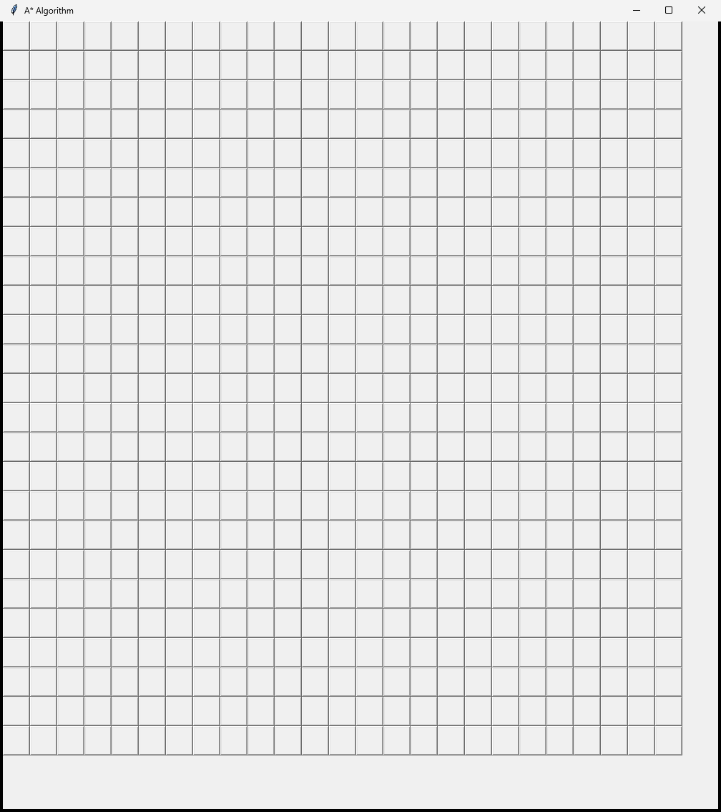

# A* Search Pathfinding Algorithm

In this project, I implemented the A* search algorithm using Python and created a GUI demonstration using tkinter. The algorithm uses a heuristic function, or a best guess, to navigate towards the goal, and returns the smallest path it took to reach the end.

For the heuristic function, I used the Euclidean distance between nodes as it performed best in my testing. 

Euclidean Distance: d(x, y)2 = (x1 - y1)2 - (x2 - y2)2

The code is based on the pseudocode found on wikipedia [here](https://en.wikipedia.org/wiki/A*_search_algorithm).

To use it, click nodes to set the desired nodes.

* First click is the start node, coloured green.

* Second click is the goal node, coloured red.

* (Optional) Third click enables barrier mode, allowing you to create blockades by simply hovering over the grid. Click again when you're happy with how it looks.

* Finally, press Enter to begin pathfinding.

## How it looks

